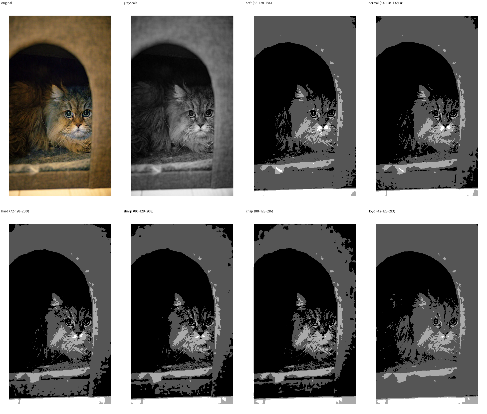

# xtmaker

Image file to XTC converter for XTEINK X3 and X4 e-readers.

## Features

- **Unified conversion pipeline** — `xtcmaker.py` handles ZIP/PDF/EPUB → XTCH
- **3-stage parallel batch processing** (4 workers)
- **6 quantize presets** for 2-bit/4-level grayscale with Floyd-Steinberg error diffusion
- **High-quality multi-step downsampling** with sharpening
- **Device-optimized** — XTEINK X4 (480×800) / X3 (528×792)

## Pipeline

```
ZIP ──→ PDF ──→ EPUB ──→ XTCH
PDF ──────────→ EPUB ──→ XTCH
EPUB ────────────────────────→ XTCH
```

## Quick Start

```bash
git clone https://github.com/smalltomatowater-boop/xtmaker.git
cd xtmaker
python -m venv venv
source venv/bin/activate
pip install -r requirements.txt
python xtcmaker.py
```

Place source files in `input/`, output goes to `xtc/`.

## Quantize Presets (2-bit)

| Preset | Thresholds | Description |
|--------|------------|-------------|
| soft | 56-128-184 | Wide midtones, natural gradation |
| normal ★ | 64-128-192 | Default (uniform quantization standard) |
| hard | 72-128-200 | Higher contrast |
| sharp | 80-128-208 | Edge emphasis |
| crisp | 88-128-216 | Maximum contrast |
| lloyd | 42-128-213 | Lloyd-Max minimum distortion |

All presets center on t2=128 with t1/t3 shifted by ±8 increments. Lower values = more midtone preservation, higher values = more contrast.

### Sample Comparison



## Tools

| File | Purpose |
|------|---------|
| `xtcmaker.py` | Main converter (ZIP/PDF/EPUB → XTCH) |
| `pdf2epub.py` | PDF → EPUB with image optimization |
| `epub2xtc.py` | EPUB → XTC/XTCH |

## Recommended Settings

| Content Type | Preset |
|--------------|--------|
| Manga/Comics | hard or sharp |
| Text documents | normal |
| Photos | soft or lloyd |
| Mixed content | normal |

## Requirements

- Python 3.10+
- PyMuPDF (AGPL-3.0)
- Pillow
- ebooklib
- rich

## License

AGPL-3.0 — PyMuPDF dependency requires AGPL-3.0 compatibility.

## Acknowledgments

- [XtcViewer](https://github.com/SimoGecko/XtcViewer) — XTCH format reference
